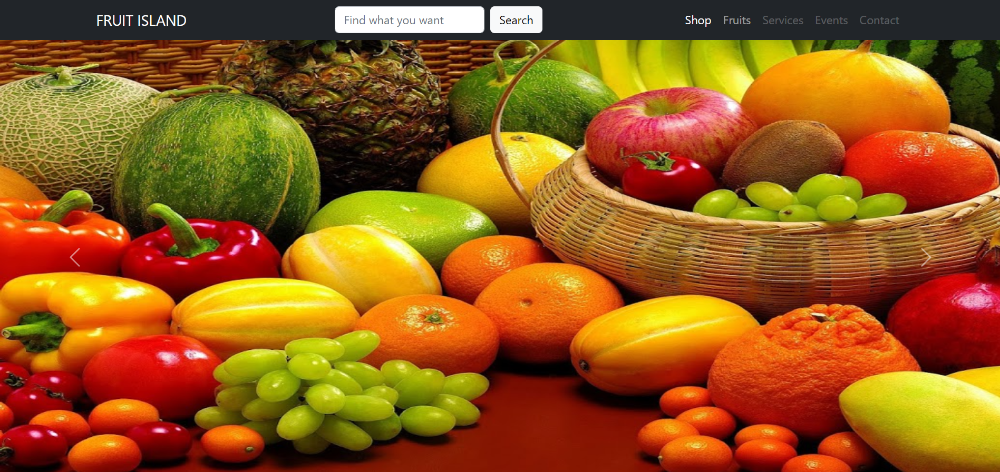

# Simple Fruit Website

</a>

## Features

- Shop
- Fruits
- Services
- Events
- Contact
- Search

## Tech

Website ini dirancang menggunakan:
- [Visual Studio Code](https://code.visualstudio.com/docs/editor/vscode-web) : Visual Studio Code merupakan editor open source yang digunakan untuk pengembangan bahasa pemrograman.
- [Google Chrome](https://www.google.com/intl/id_id/chrome/) : Google Chrome merupakan web browser yang digunakan untuk mengakses berbagai situs web dan juga menampilkan halaman web.
- [HTML] - Hypertext Markup Language: HTML merupakan bahasa markup yang ditetapkan sebagai standar dalam membuat dan merancang halaman web.
- [CSS] - Cascading Style Sheets: CSS merupakan bahasa yang digunakan untuk mengatur tampilan visual halaman web dari elemen HTML.
- [Bootstrap](https://getbootstrap.com/): Bootstrap merupakan framework front-end sumber terbuka yang digunakan untuk membangun situs web dan aplikasi web dengan cepat.
